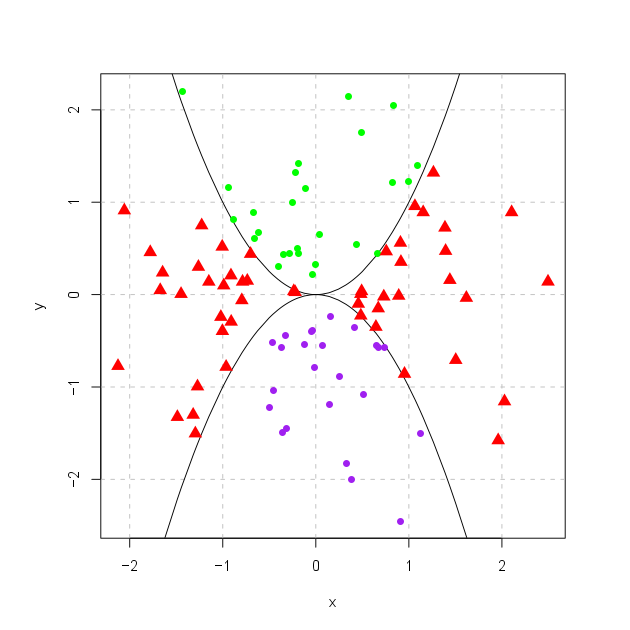

```{r setup, include=FALSE}
knitr::opts_chunk$set(echo = TRUE)
```

## Plan
[Péambule](#sec1)

[Variables et types simples](#sec2)

[Manipulation des vecteurs](#sec3)  

[IO et data.frame](#sec4)

[Autour des lois de probabilité](#sec5)

[Premiers graphiques](#sec6)  


******  
## <a name="sec1"></a> Préambule
  
Ce TP a pour objectif de vous faire découvrir les possibilités du langage **R**. Il s'agit de **bases génériques mais indispensables** à la réalisation du prochain TP qui sera appliqué aux données RNAseq.

Pour approfondir vos connaissances, il existe un tutoriel en français de référence: [R pour débutants](http://rmarkdown.rstudio.com/authoring_basics.html) par Emmanuel Paradis.

De plus, quelques bonnes pratiques, non-obligatoires mais fortement conseillées, sont repertoriées dans le [Google's R Style Guide](https://google.github.io/styleguide/Rguide.xml).

Pour commencer, récupérez le [sujet du TP](PremierPasR.Rmd) et ouvrez le avec R Studio.

******
## <a name="sec2"></a> Variables et types simples
L'operateur ***<-*** permet d'affecter une valeur indiquée/calculée (à droite du signe) dans une variable nommée (à gauche). Cette commande crée cette variable si c'est la première fois qu'elle est appelée, ou remplace sa valeur sinon.
```{r, eval=FALSE}
a <- 3
b <- 2 + a
```

Les variables *locales* apparaissent dans une **l**i**s**te grâce à la fonction **ls**. Elles peuvent également être effacer par la commande **rm**.

```{r, eval=FALSE}
ls()
rm(a)
ls()
```

On peut demander l'affichache de la valeur d'une variable de deux façons. On peut également effectuer plusieurs opérations succéssives, en les séparant par un point-virgule:
```{r, eval=FALSE}
pi
print(b)
c <- "test"; c
```

#### Questions
Il existe également des variable dites d'*environment*, connues du système dès son démarrage, par exemple *pi*. Quelle est sa valeur ? Est-il possible de modifier/effacer *pi* ?

#### Observations
Interprétez l'utilité des commandes suivantes d'après leur résultats ainsi que de tout test que vous jugerez nécessaire.
```{r, eval=FALSE}
class(a); class(c)
d <- a == c; d;
# roll
substr(c,2,3)
?substr
multiply <- function(x,mult=2){x*mult}
multiply()
multiply(b)
multiply(b,b)
multiply(mult=4,b)
ls.str()
```

******
## <a name="sec3"></a> Manipulation des vecteurs

La plus simple structure de données en **R** est le vecteur. On peut créer un vecteur en assemblant n'impporte quel nombre de valeur avec la fonction *c*.
```{r, eval=FALSE}
myVect <- c(9,9,3,16,1,7,1,6,13,1,18,13,4,2,12,2,18,1,10,12)
```

On peut également générer des vecteurs répétant une même valeur avec la fonction *rep*, et des séquences avec la fonction *seq*. Pour cette dernière, il existe notament une notation abbrégé pour l'utilisation la plus fréquente, grâce au *deux-points*.
```{r, eval=FALSE}
myRep <- rep(4,5)
mySeq <- seq(5,10,1)
mySeq == 5:10

```


#### Observations
Interprétez le fonctionnement des syntaxes suivantes d'après leur résultats ainsi que de tout test que vous jugerez nécessaire.
```{r, eval=FALSE}
myRep + seq(1,15,3)
myVect[3]
mySeq[4:2]
mean(myRep); mean(mySeq)
myVect<12
length(myVect<12)
myVect[myVect<12]
length(myVect[myVect<12])
mySeq[-3]
```

#### Questions
Quelles commandes permettraient d'obtenir:

1. Un vecteur des dizaines de 50 à 100 à partir de *mySeq* ?

2. Le dernier élément d'une liste quelle que soit sa taille ?

3. Tous les éléments de *myVect* sauf ceux en position 6, 10 et 12 ?

4. Les éléments de *myVect* inférieur à 13 mais supérieurs ou égaux à 5 ?

5. La valeur min, max d'un vecteur ? Et sa somme ? Que vous indique la fonction *summary* ?


******
## <a name="sec4"></a> IO et data.frame

On trouve dans **R** beacoup de structures de données outre les simples vecteurs, telles que le *factor*, la *list* ou la *matrix*. Celle qui nous interessera particulièrement est la *data.frame*, une extension de la matrice qui accepte des colonnes de types diférents. Observez les traitements suivants. Enregistrez alors *x* dans un fichier grâce à la fonction *write.table*. La fonction opposée, permettant de lire un fichier pour remplir les valeur d'une variale *data.frame* est utilisée au début de l'exercice suivant (*read.table*).

```{r, eval=FALSE}
y <- matrix(c(1:10,rep(c("test","orNotToTest"),5)),ncol=2)
x <- as.data.frame(y)
colnames(x)<-c("ctrl","trmt")
row.names(x)<-paste("gene",1:10,sep="_")
x; y
x[3,2]
x[1,1]
x$ctrl
class(x$trmt)
x$ctrl[x$trmt == "test"]
```

******
## <a name="sec5"></a> Autour des lois de probabilité
La loi **norm**ale est implementée en **R** à travers plusieurs fonctions qui permettent notament d'accéder à sa **d**ensité (fonction *dnorm*), ses **q**uantiles (fonction *qnorm*), sa distribution (fonction *pnorm*), ou de générer des tirages **r**andomisés (fonction *rnorm*). Que fait le code suivant?
```{r, eval=FALSE}
tirage <- rnorm(1000,mean=5,sd=2); length(tirage[tirage>=7.777])/length(tirage)
pnorm(7.777, mean=5,sd=2,lower.tail=FALSE)
```

C'est également le cas pour d'autres lois de probabilités telles que la loi de **pois**son ou la loi **unif**orme (il suffit remplacer **norm** par ce qui correspond).


******
## <a name="sec6"></a> Premiers graphiques  

R permet de créer une grande variété de graphiques, sans importer de librairies autres que celles par défault. On notera par exemple les fonctions **plot, boxplot, barplot** et **hist** qui permettent de générer la trame d'un graphique. Ce graphique pourra également être modifié par la suite grâce à d'autres fonctions telles que **points, line, abline, legend**, ... Représentez de la variable *tirage* par un histogramme et un boxplot. 


#### Exercice pour ne pas s'ennuyer ce week-end
Après avoir récupérer le fichier de données [dataExercice.txt](dataExercice.txt), exécutez le programme ci-dessous, et en vous inspirant de celui-ci, rédigez le script qui vous permettra de construire le graphe ci-après (assez similaire, mais quand même différent) et de le sauvegarder sous format *pdf*, *svg* ou *png* grâce aux fonctions associées (indice: à appeler avant *plot* et à clore par l'appel à *dev.off*) :
```{r, eval=FALSE}
data<-read.table("dataExercice.txt")
x<-data[,1]
y<-data[,2]
plot(x, y,type="n")
abline(v=0, h=0,lty=3)
lines(sort(x),sin(sort(x)))
points(x[y>sin(x)],y[y>sin(x)],pch=16,col="red")
points(x[y<sin(x) & x>0],y[y<sin(x) & x>0],pch=17,col="green")
points(x[y<sin(x) & x<0],y[y<sin(x) & x<0],pch=18,col="green",cex=2)
```

