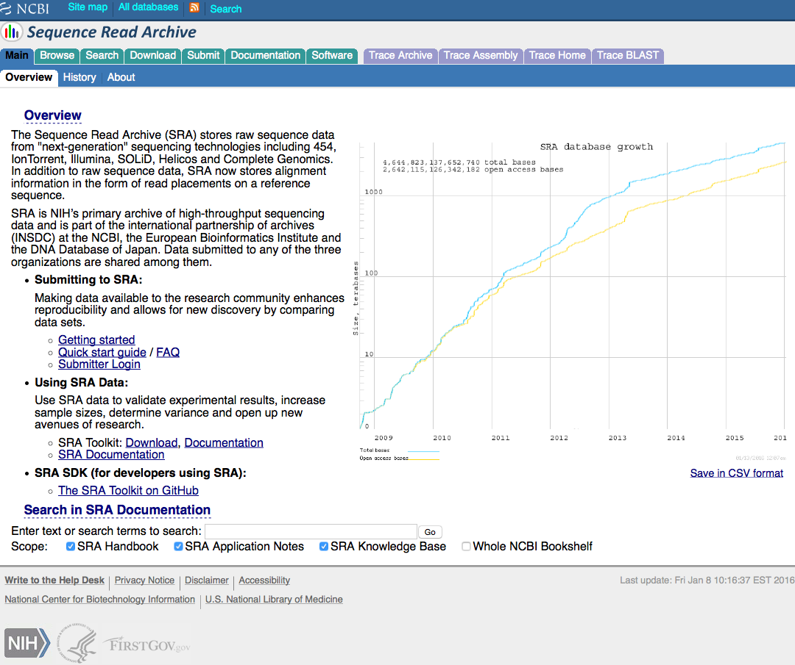
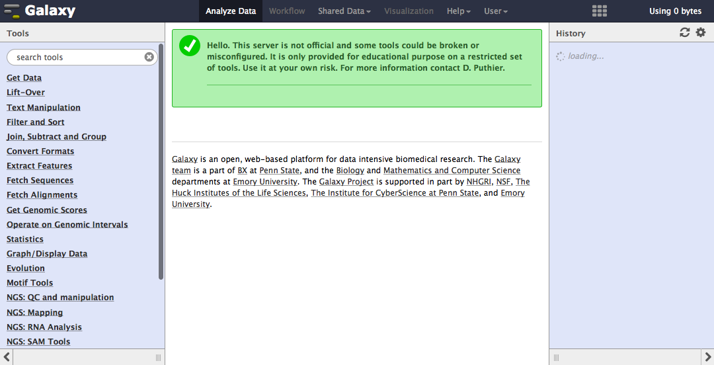

<script type="">
    $(function() {
        $(".hideshow").click(function() {
                $(this).parent().find(".solution").toggle();
        });
            
    })
</script>

<style> 
.solution {
  display:none;
}

pre:not(.sourceCode) > code {
  background-color: #2C3539!important;
  color: white;
} 
pre.text {
  background-color: #2C3539 !important;
}

hr {
  color: grey !important;
}
</style>


<!-- NOTES: this Rmd contains some automatic screenshot from web servers made using RSelenium.
You thus need to install RSelenium, png and grid R libraries. -->


### Introduction

The "Tuxedo Suite" has been developed for RNA-Seq data analysis. It is mainly composed of Bowtie, Tophat, Cufflinks, CuffDiff. It is intended to provide powerful solutions for read mapping, discovery of novel gene structures and differential expression analysis. In the practical session we will use this suite to analyse two samples obtained from study "SRP000698". This study is available in the SRA database

-------------------------------------------------------------------

### The SRP000698 dataset

In the article entitled "**Genome-wide analysis of allelic expression imbalance in human primary cells by high-throughput transcriptome resequencing**" the authors have used RNA-Seq technology to compare the transcriptome of **actived and resting T-cells**. Using this technology they were also able to monitor allele-specific expression (ASE), that is, specific expression arising from maternally and paternally derived alleles. In this tutorial we will concentrate on mapping read to the genome and compute gene expression levels with the Tuxedo suite.


-------------------------------------------------------------------

### The Sequence Read Archive database


```{r,echo=FALSE}
options(warn=-1)
suppressWarnings(suppressMessages(require(RSelenium, quietly=TRUE, warn.conflicts = FALSE)))
suppressWarnings(suppressMessages(require(png, quietly=TRUE)))
suppressWarnings(suppressMessages(require(grid, quietly=TRUE)))
checkForServer()
startServer()
remdr <- remoteDriver()
remdr$open(silent = TRUE)
remdr$navigate("http://trace.ncbi.nlm.nih.gov/Traces/sra/")
remdr$screenshot(file = "img/SRA_dataset.png")
img <- readPNG("img/SRA_dataset.png")
options(warn=0)
```



Gene Expression Omnibus ([GEO](http://www.ncbi.nlm.nih.gov/geo/)) and Sequence Read Archive ([SRA](http://trace.ncbi.nlm.nih.gov/Traces/sra/)) are public databases that provide tools to submit, access and mine functional genomics data. Data may be related to array- or sequence-based technologies. For HTS data, GEO provides both processed data (such as *.bed and *.wig files) and links to raw data. Raw data are available from the Sequence Read Archive (SRA) database (including 454, IonTorrent, Illumina, SOLiD, Helicos and Complete Genomics). Both web sites propose search engines to query their databases.

Here we will access the raw dataset through the SRA database

- The SRA Sequence Read Archive (SRA) web site can be accessed [here](http://trace.ncbi.nlm.nih.gov/Traces/sra/).
- The SRA Run browser (*Tools* section) can be used to search for a SRA object *Search &gt;SRA Objects*

<div class="exo">

1.  Get informations about the SRA study "SRP000698"
2.  What is the study about ?
3.  What platform was used ?
4.  How many reads were produced ?
5.  How many samples were analyzed ?
6.  Get informations about experiments "SRX011549" and "SRX011550"
    (SRA Objects)
7.  Which of these two samples is untreated or treated ?
9. What is the species used in this study ?
8.  How many runs were performed per samples ?
9.  Is this experiment single-end or paire-end sequencing ? What are the
    sizes of the reads ?
10. How many reads are available per run on average ? Calculate
    it roughly.
11. Select one run. What is the sequence of the first read ?
12. what is the quality of this read ?

</div>


-------------------------------------------------------------------


### About Galaxy servers

The Galaxy server motto is "Data intensive biology for everyone". Galaxy is a web-based framework for data intensive biomedical research. Galaxy can be install easily on any computer but is also proposed through remote access by numerous research groups. It is intended to ease the development of complexe workflows to analyze various types of biological data. Although it has been historically oriented toward NGS data analysis (ChIP-Seq, RNA-Seq, Ribosome profiling,...), lots of public servers are also proposing set of tools dedicated to genomics, proteomics, image analysis, cancer stem cell analysis (...). The [public server](https://wiki.galaxyproject.org/PublicGalaxyServers) web page of the galaxy team list all the available servers throughout the world (n=70 at the time of writing). 

### Connecting to the pedagogix Galaxy server

Note that the pedagogix server is only maintained for pedagogic purposes to propose privileged access to students from M2 BBSG and Polytech. It is not intended to be a production server as it is not heavily maintained.

```{r, echo=FALSE}
remdr$navigate("pedagogix-tagc.univ-mrs.fr/galaxy")
remdr$screenshot(file = "img/galaxy.png")
img <- readPNG("img/galaxy.png")
options(warn=0)
```



- Open a connection to [pedagogix Galaxy server](http://pedagogix-tagc.univ-mrs.fr/galaxy/). If this is your first connection, use the **Register** command. Otherwise, enter your login (use **Login** in the User **menu** at the top of the Galaxy window). 


-------------------------------------------------------------------

### Loading fastq files in galaxy

Analysis of the whole dataset would be time consuming. To make the analysis feasible within a reasonnable time, data were previously retrieved from SRA, fastq-transformed using SRA toolkit (fastq-dump) and mapped to the human genome (version hg19). A subset of reads that aligned onto chromosome 10 was extracted and will be used for this tutorial. The following dataset are available.

File name | Experiment  | Description |
----------|-------------|-------------|
[SRR027889.SRR027891_chr10_1.fastq.gz](ftp://tagc.univ-mrs.fr/public/Tagc/Denis/SRP000698/SRR027889.SRR027891_chr10_1.fastq.gz) | SRX011550 (Resting)| Right end read.
[SRR027889.SRR027891_chr10_2.fastq.gz](ftp://tagc.univ-mrs.fr/public/Tagc/Denis/SRP000698/SRR027889.SRR027891_chr10_2.fastq.gz) | SRX011550 (Resting)| Left end read.
[SRR027888.SRR027890_chr10_1.fastq.gz](ftp://tagc.univ-mrs.fr/public/Tagc/Denis/SRP000698/SRR027888.SRR027890_chr10_1.fastq.gz) | SRX011549 (Activated)| Right end read.
[SRR027888.SRR027890_chr10_2.fastq.gz](ftp://tagc.univ-mrs.fr/public/Tagc/Denis/SRP000698/SRR027888.SRR027890_chr10_2.fastq.gz) | SRX011549 (Activated)| Left end read.


<div class="protocol">

- In the upper left corner, click on **Unnamed history** and rename this workspace to **Control T-cells**.
- Select **Tools > Get Data > Upload File**. In the text area (**URL/Text**) paste the link to the first fastq file (**SRR027889.SRR027891_chr10_1.fastq.gz**).
- Select **fastqsanger** (**not fastqcsanger** !) as **File Format** and hg19 (GRCh37) as a reference genome. Press Execute.
- On the right column, click on the pencil (**edit attributes**) and change the name to Control_1.

</div>

Perform the same procedure with file 'SRR027889.SRR027891_chr10_2.fastq.gz' (the output name should be Control_2).

-------------------------------------------------------------------

### Checking format with the galaxy groomer

Once loaded into the galaxy framework the fastq file should be checked for their format using the groomer tool.

<div class="protocol">

- Select NGS TOOLS > NGS: QC and manipulation > FASTQ Groomer.
- Set File to groom to 'Control_1', and press Execute
- Rename the output of the previous step into 'Control_1_groom' (use the pencil that is associated to each item of the history to edit their attributes).

</div>

Perform the same procedure with dataset 'Control_2'.

-------------------------------------------------------------------

### Quality control with FastQC

**FastQC** aims to provide a simple way to do some **quality control** checks on raw sequence data coming from high throughput sequencing pipelines. It provides a modular set of analyses which you can use to give a quick impression of whether your data has any problems of which you should be aware before doing any further analysis. FastQC can be run as a stand alone interactive application for the immediate analysis of small numbers of FastQ files, in a non-interactive mode (through shell commands) where it would be suitable for integrating into a larger analysis pipeline for the systematic processing of large numbers of files or through the Galaxy framework.

It is important to stress that although the analysis results appear to give a pass/fail result, these evaluations must be taken in the context of what you expect from your library. A 'normal' sample as far as FastQC is concerned is random and diverse. Some experiments may be expected to produce libraries which are biased in particular ways. You should treat the summary evaluations therefore as pointers to where you should concentrate your attention and understand why your library may not look random and diverse.

<div class="protocol">

- Use **NGS: QC and manipulation > FastQC:Read QC**.
- Select the first fastq file (**Control_1_groom**) and press **Execute**.
- Display the data for the corresponding fastqc result (use the view (eyes) icon above the dataset name in the right panel).
- Carefully inspect all the statistics. 
- What do you think of the overall quality of the sequencing ?
- What is the format of quality encoding. You need to know it to perform next step (read trimming).

</div>

Perform the same operation for **Control_2_groom** file.

------------------------------------------------------------------------

### Read trimming

Read trimming is a pre-processing step in which input read ends are cutted (most generally the right end). Here, reads were previously trimmed. However one should keep in mind that this step is crucial when working with aligners. Indeed aligners may be unable to align a large fraction of the dataset when poor quality ends are kept. Several software may be used to perform sequence trimming:


-   [FASTX-Toolkit](http://hannonlab.cshl.edu/fastx_toolkit/)
-   [sickle](https://github.com/najoshi/sickle)
-   [the ShortRead Bioconductor package](http://bioconductor.org/packages/2.11/bioc/html/ShortRead.html)
- ...

Here we will use sickle. 

<div class="protocol">

- Search for the sickle tool using the galaxy search engine (upper left corner). 
- Select sickle tool.
- Set **Single-End or Paired-End reads** to **Paired-end**.
- From **Paired-End Forward Strand FastQ Reads** dropdown list select 'Control_1_groom'.
- From **Paired-End reverse Strand FastQ Reads** dropdown list select 'Control_2_groom'.
- Set **Quality Threshold to 20, Length Threshold to 25** and press execute.
- Rename **Paired-End forward strand output of Sickle** to Control_1_trim.
- Rename **Paired-End reverse strand output of Sickle** to Control_2_trim.
- Delete **Singletons from Paired-End** dataset.
- Perform a new fastqc analysis using the trimmed read as input. 
- The number of reads should be reduced.

</div>

------------------------------------------------------------------------

### Getting the sequence of human chromosome 10 at UCSC

```{r, echo=FALSE}
remdr$navigate("https://genome.ucsc.edu/")
remdr$screenshot(file = "img/ucsc.png")
img <- readPNG("img/ucsc.png")
options(warn=0)
```


Most of the time the galaxy server will provide you with an already indexed genome that can be used by tophat to perform read alignment. In this practical, we would like to restrict the alignment to chromosome 10 (this will be faster). We thus need to download the sequence of human chromosome 10. This sequence will be provided to tophat in the subsequent steps (tophat will perform sequence indexing internally by calling bowtie-build).

The sequence of the chr19 can be downloaded through the [UCSC web site](http://hgdownload.soe.ucsc.edu/goldenPath/hg19/chromosomes/).

<div class="protocol">

- Go to the UCSC ftp web site. Copy the link adress to **chr10.fa.gz**.
- Select **Tools > Get Data > Upload File**. In the text area (**URL/Text**) paste the link to the chr10 sequence.
- Select **fasta** as **File Format** and **hg19** as a reference genome. Press Execute to import the sequence into your history.
- Check the first lines and last line of the file using head and tail respectively (**Text Manipulation > head-or-tail**).
- How to you explained the N stretch inside the sequence ?
- Rename the record in the history to **chr10.fa**.

</div>

**NB**: the chromosome sequence can also be obtained from [ensembl ftp web site](http://www.ensembl.org/info/data/ftp/index.html).


-----------------------------------------------------------------

### Downloading transcript annotation (ensembl) in gtf format


In order to provide topHat with the location of known exons in the human genome, we will download a file in GTF format (Gene transfer format). You can get more information about this format on [UCSC web site](https://genome.ucsc.edu/FAQ/FAQformat.html#format4) or [GENCODE](http://www.gencodegenes.org/gencodeformat.html) web site.

GTF file can be obtained both from **UCSC** [table browser](https://genome.ucsc.edu/cgi-bin/hgTables) or **ensembl** [ftp web site](http://www.ensembl.org/info/data/ftp/index.html). 

**NB**: it is very important at this step to ensure that the fasta file and the GTF file are obtained from the genome release (here human genome version 19). The chromosome sequences and gene positions vary between genome releases.

Here we will download a GTF file containing information related transcript from chromosome human chromosome 10. This GTF file was obtained from **ensembl archive** [web site](http://www.ensembl.org/info/website/archives/index.html) (release 67 corresponding to GRCh37/hg19). 

<div class="protocol">

- Select **Tools > Get Data > Upload File**. In the text area (**URL/Text**) paste the link to the GTF file ([here](http://pedagogix-tagc.univ-mrs.fr/courses/data/ngs/jgb71e-polytech-bioinfo-app/Homo_sapiens.GRCh37.67_chr10.gtf.gz))
- Select **GTF** as **File Format** and hg19 (GRCh37) as a reference genome. Press Execute.
- On the right column, click on the pencil (**edit attributes**) and change the name to hg19_ensembl_gtf.

</div>


-------------------------------------------------------------------

### Mapping read with TopHat

TopHat is a fast splice junction mapper for RNA-Seq reads. It aligns RNA-Seq reads to mammalian-sized genomes using the ultra high-throughput short read aligner Bowtie, and then analyzes the mapping results to identify splice junctions between exons.

We will start by mapping the reads corresponding to control sample.

<div class="protocol">

- Select **NGS: Mapping > Tophat2** from the toolbox.
- Set "Is this library mate-paired?:" to "Paired-end".
- Set **RNA-Seq FASTQ file, forward reads** to "Control_1_trim".
- Set **RNA-Seq FASTQ file, reverse reads** to "Control_2_trim".
- Set **Use a built in reference genome or own from your history** to "Use a genome from history".
- Set **Select the reference genome** to **chr10.fa**.
- Set **TopHat settings to use** to **Full parameter list**.
- Set **Use Own Junctions ** to **yes**.
- Set **Use Gene Annotation Model** to **yes**.
- Set **Gene Model Annotations** to **hg19_ensembl_chr10.gtf**.
- Press **Execute**.
- Rename the bam file to control.bam. 
- Rename the 'splice-junction' bed file to control_splice_junctions.bed.

</div>

**NB:** By default tophat will accept reads whose genomic mapping is ambiguous. This multi-mapped reads may be problematic in the downstream analysis. Indeed, keeping them may introduce spurious transcript models when trying to reconstruct underlying transcripts. However discarding them may also be problematic when computing expression levels of gene families.
The **-g/--max-multihits** argument instructs TopHat to allow up to this many alignments to the reference for a given read, and choose the alignments based on their alignment scores if there are more than this number. The default is 20 for read mapping. Depending on the need, more stringent policy may be choosen (e.g -g 1 indicating that muti-mapped reads should be discarded). Additional arguments are available in the command line version of tophat including -x/--transcriptome-max-hits and -M/--prefilter-multihits.

-------------------------------------------------------------------


### Checking the number of aligned reads

We will used **samtools flagstat** to assess the number of aligned read available in the bam file.

- Select **Statistics > flagstat**.
- Select the **BAM** file and press **Execute**.
- Check the statistics. Is that expected ?

### Viewing the results with Integrated Genome Browser (IGV).

```{r, echo=FALSE}
remdr$navigate("https://www.broadinstitute.org/igv/")
remdr$screenshot(file = "img/igv.png")
img <- readPNG("img/igv.png")
options(warn=0)
```


The Integrative Genomics Viewer (IGV) is a high-performance visualization tool for interactive exploration of large, integrated genomic datasets. It supports a wide variety of data types, including array-based and next-generation sequence data, and genomic annotations.

<div class="protocol">

- Create an IGV account [here](https://www.broadinstitute.org/igv/?q=registration).
- Download IGV and launch it with 750 MB or 1.2 Gb depending of your machine.
- Select hg19 as a genome and browse to chromosome 10.
- In galaxy select tophat result (bam format) and download the **bam** file.
- In galaxy select tophat result (bam format) and download the **bai** file.
- In IGV, go to the IL2RA gene (by typing 'IL2RA' in the **GO** text area).
- Zoom to view alignments.
- In the left panel right click on the bam fil name and select **View as pairs**.
- In the left panel right click on the bam fil name and set **Color Alignments by > Read strand**.
- In galaxy select tophat result (**control_splice_junctions.bed**) and download the **bed** file. If this file does not contain a **bed** extension, rename it to add **.bed**.
- Load the **control_splice_junctions.bed** into IGV (File > Load from file).
- Unzoom to view the number of alignments supporting exon junctions.
- Mouse over a junction on of **control_splice_junctions.bed** track. What is the **Depth** about ?

</div>


-------------------------------------------------------------------

### Creating a bigwig track

As you may have notice the user needs to zoom inside IGV to visualize the alignments. This is due to the fact that BAM files may be very large (tens of Gb or more). Loading all information from the file would thus saturate the computer memory. We will thus create a more lightweight file that will just provide us with the mean coverage of each genomic region. This file in bigWig format will be compressed and indexed as the BAM files.

<div class="protocol">

- Use the **Convert format > BAM to BigWig** tool to convert the BAM file to a bigWig format.
- Download this file and load it into Galaxy.
- In IGV, on the left panel, right click on the bigwig track name. Use 'Set data range' and set the value to 20.
- GO to gene 'BAG3'.
- In the BAG3 gene some exonic region are larger than others ? What are they ? Where are the 3' and 5' UTR regions ?
- In the left panel, right click on the GTF file name and click on **expand** to visualize all known isoforms of BAG3.
- What about the gene that is 6kb upstream (5' orientation) of BAG3. Does it appear in the IGV RefSeq track. What could it be ?
- To check if this transcript is included in ensembl annotation, retrieve the GTF file from Galaxy. Check if the file extension is correct (.gtf). Load it into Galaxy. 
- Is the transcript downstream to BAG3 part of ensembl annotation ?
- What about this trancript model ? Does it seem to multiexonic ? What would be roughly the cDNA length ? What kind of RNA could it be ?

</div>

-------------------------------------------------------------------

### Using ensembl genome browser to get information about BAG3 and ENST00000454541

```{r, echo=FALSE}
remdr$navigate("http://www.ensembl.org/index.html")
remdr$screenshot(file = "img/ensembl.png")
img <- readPNG("img/ensembl.png")
options(warn=0)
```


Go to the ensembl [genome browser](http://www.ensembl.org/).

Get some information about BAG3:

<div class="exo">

- In the **search panel** select **Human**. In the text area of the search panel type **BAG3**.
- Click on entry **ENSG00000151929**. What is the meaning of the **ENSG** prefix ?
- What is the **description** associated to BAG3 ? What does **athanogene** mean ?
- Ask for **Show transcript table**. How many transcript are associated with BAG3 ?
- Does it correspond to the number of transcripts displayed in IGV. Do they have the same IDs ? What about the **ENST** prefix ?
- What is the **biotype of this transcript** ?
- Some links are provided toward **RefSeq** and **UniprotDB**. What kind of information do they store ?
- What are the known **phenotypes** associated with defect in this gene ?
- How many **orthologues** and **paralogues** are linked to human BAG3 ?

</div>

Get some information about : ENST00000454541

<div class="exo">

- What is the **gene identifier** of ENST00000454541 ?
- What is the length of its cDNA ?
- What is its associated **biotype** ?
- Go to [this web page](http://vega.sanger.ac.uk/info/about/gene_and_transcript_types.html) to get the definition associated with **Gene type**. What is a **Processed pseudogene** ?

</div>

------------------------------------------------------------------------

### Searching for novel transcript with cufflinks

We can now use the cufflinks software to try to discover new transcripts inside the dataset. We will also provide cufflinks with the set of known transcript.

<div class="protocol">

- In the toolbox, select **NGS: RNA Analysis > Cufflinks**.
- Select the bam file in the **SAM or BAM file of aligned RNA-Seq reads** menu.
- Set **Use Reference Annotation** to **Use reference annotation as guide**.
- Set **Set advanced Cufflinks options** to **yes**.
- Set **Library prep used for input read** to **fr-unstranded**.
- Press **execute**.

</div>

------------------------------------------------------------------------

### Extracting a workflow

Galaxy allows user to apply the developed pipeline to another set of sample. In order to do that, the user must create a **workflow**.

<div class="protocol">

- In the history menu, select **history options**.
- Click on **Extract workflow**.
- Set the name of the new workflow to **RNA-Seq part 1**.

</div>

------------------------------------------------------------------------

### Apply the workflow to the second sample

We will now apply this workflow to the sample corresponding to **activated T-cell**.

<div class="protocol">

- Create a new history: **History > Create new**.
- Rename this workspace : **Activated T-cells**.
- Load the to fastq files corresponding to activated T-cells in this workspace using **get data**.
- Use **History > Copy datasets** to copy **hg19_ensembl_chr10** and **chr10.fa** datasets into **Activated T-cells** history.
- In the top menu select **workflow > RNA-Seq part 1 > edit**. Have a look at your new workflow. Check the input files.  
- Select **workflow > RNA-Seq part 1 > run**. Set the to fastq file **SRR027888.SRR027890_chr10_1.fastq** as input 1, the second fastq file as input 2, the fasta file as input 3 and the gtf as input 4. Press **Run workflow** at the bottom of the page.

</div>

------------------------------------------------------------------------

## Selecting unknown transcript

We now have three different GTF files:

- The reference annotation
- The discovered transcripts in the control sample.
- The discovered transcripts in the activated sample.

We will ask **cuffmerge** to compare the two novel annotation to the reference and to classify the transcripts. It will annotate transcripts by producing a GTF file containing flags. Some of this flags may indicate that:

- The transcript is unknown.
- The transcript is a novel isoform of a known transcript.
- The transcript corresponds to immature form of a known transcript.
- ...

For a full description of all possible flags ("class code"), please refer to the [cuffmerge](http://cole-trapnell-lab.github.io/cufflinks/cuffcompare/) web site (section 'Transfrag class codes').

Here we will concentrate on retrieving the position of novel transcripts.

Create a new history named **assemby and quantification**.


<div class="protocol">

- Use **History > Copy datasets** to copy **assembled transcript** file contained in the **Activated T-cells** and **Control T-cells** history into this novel history.
- Copy the **hg19_ensembl_chr10** into this novel history.
- Use **History > Copy dataset** to copy **assembled transcript** files contained in the **Activated T-cells** and **Control T-cells** history into this novel history.
- Now select **NGS: RNA Analysis > cuffmerge**. Set **GTF file(s) produced by Cufflink** to the two **assembled transcript** files. 
- Select **Use Reference Annotation**. Set **Reference Annotation** to **hg19_ensembl_chr10**.Press **Execute**.
- Use **Filter and sort > Select lines that match an expression**. Select line containing 'class_code "u"'. The 'u' indicate they are unknown genes (not present in the reference annotation).
- How many transcripts were classified as unknown ?
- Merge this unknown transcript with the reference annotation (**hg19_ensembl_chr10**) using **Text Manipulation > Concatenate datasets**. 
- Rename the file to **Assembly.gtf**.

</div>

----------------------------------------------------

## Quantification

The objective of quantification is to estimate the expression level of each gene by counting the number of reads overlapping each gene model. Several software have been developed for this task (cuffdiff, featureCount, HTSeq-count,...). The FeatureCounts software is a light-weight read counting program written entirely in the C programming language.  It has a variety of advanced parameters but its major strength is its outstanding performance (10GB SE BAM file takes about 7 minutes on a single average CPU).

<div class="protocol">

- Copy the two bam files in the **assemby and quantification** history.
- Select **NGS: RNA Analysis > featureCounts**.
- Select the two bam files in **Alignment file**.
- Set **GFF/GTF Source** to Use reference from history.
- Select **assembly.gtf** as Gene annotation file.
- Set **featureCounts parameters** to **extended format**.
- Set **GFF feature type filter** to exon (we want to count inside exonic regions).
- Set **GFF gene identifier** to **gene_id** (all exons of all transcripts of a given gene will be summed up to get the final expression value).
- Set **Strand specific protocol** to fr-unstranded.
- Press **Execute**.
- Check the **Summary file**. What are **Unassigned_MultiMapping**, **Unassigned_NoFeatures**, **Unassigned_MappingQuality**, **Unassigned_Chimera** ?

</div>
----------------------------------------------------

## Descritive statistics with R

<div class="protocol">

- Download the gene expression table produced by featureCount.
- Rename the file to **raw_counts.txt**.
- Open **RStudio**.

```{r}
## First we read gene counts
count <- read.table("raw_counts.txt" ,sep="\t", head=T,row=1)
#head(count)
#head(rownames(count))
#colnames(count)

# Change column names
colnames(count) <- c("Activated", "Resting")
## Values are log2 transformed 
## (a pseudo-count is added in case one of the sample is equal or close to zero)
count <- log2(count +1)

## Checking distribution of FPKM values
hist(as.matrix(count), main="Distribution of count values")
boxplot(count, col=c("red","gray"), pch=16, main="Boxplot for count valaues")


## Scatter plot comparing expression levels in sample 1 and 2
par(xaxs='i',yaxs='i')
plot(count, pch=20, panel.first=grid(col="darkgray"))
identify(count[,1], count[,2],lab=rownames(count))

```
</div>


## What's about ENSG00000134460 ?

The gene ENSG00000134460 seems to be strongly induced during T-cell activation. Go to Ensembl genome Browser and use the search area to get some information about it. Is this positive regulation expected ?


